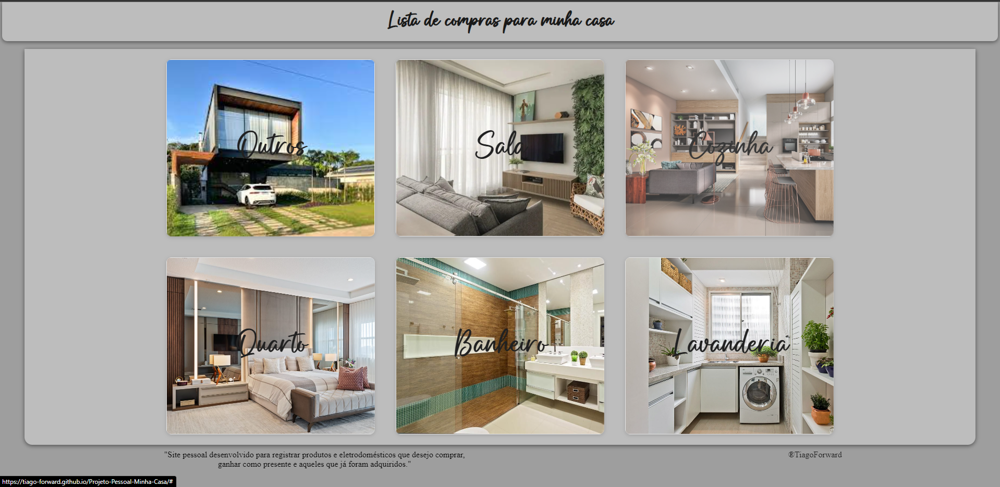

# Projeto Pessoal | Minha Casa

## Tabela do Conteudo

<ul>
<li><a href="#sobre">Sobre</a></li>
<li><a href="#status">Status</a></li>
<li><a href="#objetivo">Objetivo</a></li>
<li><a href="#curiosidade">Curiosidade</a></li>
<li><a href="#tecnologias">Tecnologias</a></li>
<li><a href="#acessando-o-site">Acessando o site</a></li>
</ul>

## Sobre

### Meu projeto!

## Status

Desafio parado, desenvolvendo meu portfolio!👌

## Objetivo

Meu objetivo é praticar meu HTML e CSS e criar um site que eu possa salvar imagens de todos os móveis e eletrodomésticos que pretendo comprar.

## Curiosidade

Pretendo aprender futuramente a criar uma biblioteca.

## Tecnologias

<ul>
<li>HTML</li>
<li>CSS</li>
<li>GIT BASH</li>
</ul>

## Acessando o site

Para acessar o site da Minha Casa, por favor use esse link : <a href="https://tiago-forward.github.io/Projeto-Pessoal-Minha-Casa/" target="_blank">Projeto Pessoal | Minha Casa</a>